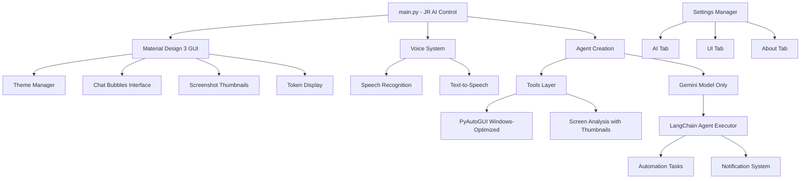

# JR AI Control - Enhanced Features Design Document

## Overview

This design outlines the comprehensive enhancement of JR AI Control (formerly Clevrr Computer) with advanced features including voice interaction, Material Design 3 UI, token tracking, screenshot thumbnails, notifications, and modern chat interface. The application maintains its Windows-optimized, Gemini-only foundation while adding significant user experience improvements.

## Architecture

### Current Architecture Issues
- Mixed model support with hardcoded model selection bug
- Unnecessary Azure OpenAI dependencies
- Linux-oriented font loading and system configurations
- Bloated requirements.txt with unused packages

### Enhanced Architecture
- Material Design 3 UI with dark/light theme support
- Voice interaction system with TTS/STT capabilities
- Token tracking and usage analytics
- Screenshot thumbnail integration
- Notification system for task completion
- Tabbed settings with comprehensive customization options



## Components and Interfaces

### 1. Model Configuration (utils/contants.py)
**Changes:**
- Remove Azure OpenAI model configuration
- Simplify MODELS dictionary to only include Gemini
- Update environment variable loading to only require GOOGLE_API_KEY
- Add Windows-specific font configuration

**Interface:**
```python
MODELS = {
    "gemini": ChatGoogleGenerativeAI(...)
}
```

### 2. Agent Creation (utils/agent.py)
**Changes:**
- Fix hardcoded model bug by properly using the model parameter
- Remove Azure OpenAI imports and references
- Ensure proper model injection into agent creation

**Interface:**
```python
def create_clevrr_agent(model, prompt):
    # Use the passed model parameter instead of hardcoding
    agent = create_react_agent(model, tools, prompt)
    return AgentExecutor(...)
```

### 3. Screen Analysis Tool (utils/tools.py)
**Changes:**
- Update font loading for Windows compatibility
- Use system font fallbacks for Windows
- Ensure Gemini model is used for image analysis
- Optimize screenshot handling for Windows

**Interface:**
```python
def get_ruled_screenshot():
    # Windows-compatible font loading
    try:
        font = ImageFont.truetype("arial.ttf", 25)
    except (IOError, OSError):
        # Windows fallback fonts
        try:
            font = ImageFont.truetype("C:/Windows/Fonts/arial.ttf", 25)
        except (IOError, OSError):
            font = ImageFont.load_default()
```

### 4. Main Application (main.py)
**Changes:**
- Remove OpenAI from model choices
- Update argument parser to only support Gemini
- Simplify model selection logic

**Interface:**
```python
parser.add_argument('--model', type=str, default='gemini', 
                   choices=['gemini'], help="Model to use (Gemini only)")
```

## Data Models

### Environment Configuration
```
GOOGLE_API_KEY=<your_gemini_api_key>
VERSION=0.9.2
LAST_CHANGES=["Migrated to Gemini-only", "Windows optimization"]
```

### Model Configuration
```python
GEMINI = ChatGoogleGenerativeAI(
    model="gemini-1.5-pro-latest",
    google_api_key=os.getenv("GOOGLE_API_KEY"),
)

MODELS = {
    "gemini": GEMINI
}
```

## Error Handling

### 1. Font Loading Errors
- Primary: Try system-specific font paths
- Secondary: Fall back to default fonts
- Tertiary: Use PIL default font as last resort

### 2. Model Initialization Errors
- Validate GOOGLE_API_KEY presence
- Provide clear error messages for missing API keys
- Graceful degradation if model fails to initialize

### 3. Windows Compatibility Errors
- Handle Windows-specific PyAutoGUI exceptions
- Provide Windows-specific error messages and solutions
- Test key combinations and screen capture on Windows

## Testing Strategy

### 1. Unit Tests
- Test model parameter injection in agent creation
- Test Windows font loading fallback mechanisms
- Test environment variable loading

### 2. Integration Tests
- Test complete automation workflow with Gemini
- Test screen analysis tool with Windows screenshots
- Test GUI functionality on Windows

### 3. Platform-Specific Tests
- Test PyAutoGUI operations on Windows
- Test font rendering and coordinate accuracy
- Test Windows key combinations and hotkeys

### 4. Dependency Tests
- Verify all required packages install correctly on Windows
- Confirm no Azure OpenAI dependencies remain
- Test application startup with minimal dependencies

## Migration Steps

### Phase 1: Dependency Cleanup
1. Create new requirements.txt with only necessary packages
2. Remove Azure OpenAI related packages
3. Keep essential LangChain and Gemini packages

### Phase 2: Code Refactoring
1. Fix agent creation bug in utils/agent.py
2. Remove Azure OpenAI code from utils/contants.py
3. Update Windows font handling in utils/tools.py
4. Simplify main.py model selection

### Phase 3: Configuration Updates
1. Update .env_dev template
2. Remove Azure-specific environment variables
3. Update documentation

### Phase 4: Testing and Validation
1. Test on Windows systems
2. Verify all automation features work
3. Confirm dependency installation
4. Validate performance improvements

## Performance Considerations

### Reduced Memory Footprint
- Removing unused Azure OpenAI dependencies
- Streamlined model loading
- Optimized import statements

### Windows Optimization
- Native Windows font handling
- Optimized PyAutoGUI settings for Windows
- Reduced startup time with fewer dependencies

## Security Considerations

### API Key Management
- Only require single GOOGLE_API_KEY
- Remove unused Azure credentials from environment
- Maintain secure API key handling practices

### System Access
- Maintain existing PyAutoGUI safety measures
- Ensure Windows-specific security considerations
- Preserve user consent mechanisms for automation tasks
## Enhanc
ed Components and Interfaces

### 1. Material Design 3 UI System (ui/material_design.py)
**New Component:**
- Implement Material Design 3 color schemes and typography
- Create custom widgets with MD3 styling
- Support dynamic theme switching (dark/light)
- Hidden scrollbars with custom styling

**Interface:**
```python
class MaterialDesign3Theme:
    def __init__(self, theme_mode='dark'):
        self.theme_mode = theme_mode
        self.colors = self.load_color_scheme()
    
    def apply_theme(self, root_widget):
        # Apply MD3 styling to all widgets
    
    def switch_theme(self, new_mode):
        # Dynamically switch between dark/light
```

### 2. Voice Interaction System (voice/voice_manager.py)
**New Component:**
- Speech-to-text using Windows Speech Recognition API
- Text-to-speech using Windows SAPI
- Voice activity detection
- Speech mute/unmute controls

**Interface:**
```python
class VoiceManager:
    def __init__(self):
        self.stt_engine = SpeechRecognition()
        self.tts_engine = TextToSpeech()
        self.is_listening = False
        self.speech_enabled = True
    
    def start_listening(self):
        # Begin speech recognition
    
    def speak_response(self, text):
        # Convert text to speech
    
    def toggle_speech(self, enabled):
        # Enable/disable speech output
```

### 3. Token Tracking System (utils/token_tracker.py)
**New Component:**
- Track tokens per message and total usage
- Persistent storage of token counts
- Real-time token display updates

**Interface:**
```python
class TokenTracker:
    def __init__(self):
        self.total_tokens = self.load_total_tokens()
        self.message_tokens = {}
    
    def count_tokens(self, text):
        # Calculate token count for text
    
    def add_message_tokens(self, message_id, tokens):
        # Track tokens for specific message
    
    def get_total_usage(self):
        # Return total token usage
```

### 4. Screenshot Thumbnail System (utils/screenshot_manager.py)
**Enhanced Component:**
- Generate thumbnails from screenshots
- Embed thumbnails in chat interface
- Click-to-expand functionality
- Configurable thumbnail sizes

**Interface:**
```python
class ScreenshotManager:
    def __init__(self, thumbnail_size=(150, 100)):
        self.thumbnail_size = thumbnail_size
        self.screenshots = []
    
    def take_screenshot_with_thumbnail(self):
        # Take screenshot and generate thumbnail
    
    def create_thumbnail(self, image_path):
        # Create thumbnail from full image
    
    def get_thumbnail_for_chat(self, screenshot_id):
        # Return thumbnail for chat display
```

### 5. Notification System (utils/notifications.py)
**New Component:**
- Windows toast notifications
- Task completion alerts
- Progress indicators
- Notification queue management

**Interface:**
```python
class NotificationManager:
    def __init__(self):
        self.notification_queue = []
        self.enabled = True
    
    def show_task_completion(self, task_name, details):
        # Show task completion notification
    
    def show_progress_update(self, progress, message):
        # Show progress notification
    
    def queue_notification(self, notification):
        # Add notification to queue
```

### 6. Chat Bubble Interface (ui/chat_bubbles.py)
**Enhanced Component:**
- Modern speech bubble design
- Left-aligned AI messages, right-aligned user messages
- Message action buttons (resend, copy, delete)
- Timestamp and sender name display

**Interface:**
```python
class ChatBubbleInterface:
    def __init__(self, parent_widget):
        self.parent = parent_widget
        self.messages = []
    
    def add_user_message(self, message, timestamp):
        # Add right-aligned user message bubble
    
    def add_ai_message(self, message, timestamp, tokens):
        # Add left-aligned AI message bubble
    
    def add_message_actions(self, message_widget, message_id):
        # Add resend, copy, delete buttons
```

### 7. Tabbed Settings System (ui/settings_tabs.py)
**Enhanced Component:**
- Three-tab interface: AI, UI, About
- AI tab: Model selection, speech toggle
- UI tab: Theme switch, screenshot settings
- About tab: App info, tips, developer details

**Interface:**
```python
class SettingsTabManager:
    def __init__(self, parent_window):
        self.parent = parent_window
        self.tabs = {}
    
    def create_ai_tab(self):
        # Model settings, speech controls
    
    def create_ui_tab(self):
        # Theme, screenshot size, wait duration
    
    def create_about_tab(self):
        # App info, tips, developer details
```

## Data Models

### Enhanced Configuration
```python
# config.json structure
{
    "api_key": "your_gemini_api_key",
    "model": "gemini-2.0-flash-exp",
    "theme_mode": "dark",
    "speech_enabled": true,
    "speech_muted": false,
    "screenshot_size": "medium",
    "screenshot_wait_duration": 3,
    "total_tokens_used": 15420,
    "notification_enabled": true
}
```

### Voice Settings
```python
class VoiceSettings:
    speech_enabled: bool = True
    speech_muted: bool = False
    voice_rate: int = 200
    voice_volume: float = 0.8
    recognition_language: str = "en-US"
```

### UI Settings
```python
class UISettings:
    theme_mode: str = "dark"  # "dark" or "light"
    screenshot_size: str = "medium"  # "small", "medium", "large"
    screenshot_wait_duration: int = 3  # 1-10 seconds
    hide_scrollbars: bool = True
    animation_enabled: bool = True
```

### Message Data Model
```python
class ChatMessage:
    id: str
    sender: str  # "user" or "ai"
    content: str
    timestamp: datetime
    tokens_used: int
    has_screenshot: bool = False
    screenshot_thumbnail: str = None
```

## Material Design 3 Implementation

### Color Schemes
```python
# Dark Theme
DARK_THEME = {
    'primary': '#BB86FC',
    'on_primary': '#000000',
    'secondary': '#03DAC6',
    'on_secondary': '#000000',
    'background': '#121212',
    'surface': '#1E1E1E',
    'on_surface': '#FFFFFF',
    'error': '#CF6679'
}

# Light Theme
LIGHT_THEME = {
    'primary': '#6200EE',
    'on_primary': '#FFFFFF',
    'secondary': '#018786',
    'on_secondary': '#FFFFFF',
    'background': '#FFFFFF',
    'surface': '#F5F5F5',
    'on_surface': '#000000',
    'error': '#B00020'
}
```

### Typography System
```python
TYPOGRAPHY = {
    'headline_large': ('Segoe UI', 32, 'normal'),
    'headline_medium': ('Segoe UI', 28, 'normal'),
    'headline_small': ('Segoe UI', 24, 'normal'),
    'title_large': ('Segoe UI', 22, 'bold'),
    'title_medium': ('Segoe UI', 16, 'bold'),
    'title_small': ('Segoe UI', 14, 'bold'),
    'body_large': ('Segoe UI', 16, 'normal'),
    'body_medium': ('Segoe UI', 14, 'normal'),
    'body_small': ('Segoe UI', 12, 'normal'),
    'label_large': ('Segoe UI', 14, 'bold'),
    'label_medium': ('Segoe UI', 12, 'bold'),
    'label_small': ('Segoe UI', 11, 'bold')
}
```

## Enhanced Error Handling

### Voice System Errors
- Handle microphone access permissions
- Manage speech recognition failures
- Handle TTS engine initialization errors
- Provide fallback text-only mode

### UI Theme Errors
- Handle theme switching failures
- Manage color scheme loading errors
- Provide fallback to default theme

### Token Tracking Errors
- Handle token calculation failures
- Manage persistent storage errors
- Provide estimated token counts as fallback

## Performance Considerations

### Voice Processing
- Asynchronous speech recognition to prevent UI blocking
- Efficient audio buffer management
- Optimized TTS queue processing

### UI Rendering
- Efficient theme switching without full re-render
- Optimized chat bubble rendering for large conversations
- Lazy loading of screenshot thumbnails

### Memory Management
- Efficient storage of chat history
- Compressed thumbnail storage
- Periodic cleanup of old screenshots

## Security and Privacy

### Voice Data
- Local speech processing (no cloud STT/TTS)
- No storage of voice recordings
- User control over microphone access

### Screenshot Data
- Local storage of screenshots and thumbnails
- User control over screenshot retention
- Secure deletion of sensitive screenshots

### Token Tracking
- Local storage of usage statistics
- No transmission of usage data
- User control over data retention