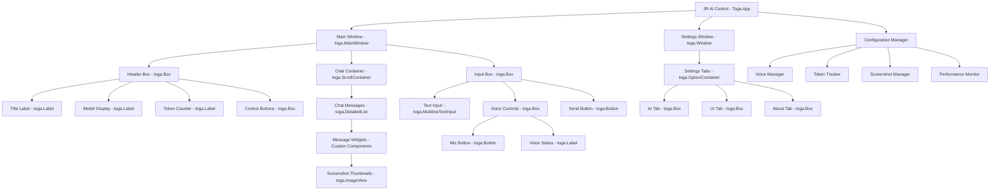
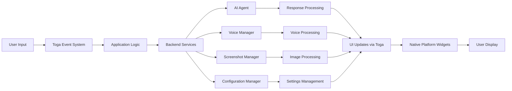

# UI Migration to Toga - Design Document

## Overview

This design document outlines the comprehensive migration of JR AI Control from its current Material Design 3 (MD3) Tkinter-based UI to a modern Toga-based cross-platform interface. The migration will transform the application architecture while preserving all existing functionality and improving cross-platform compatibility, performance, and maintainability.

## Architecture Design

### System Architecture Diagram



### Data Flow Diagram



## Component Design

### Core Application Component (main_toga.py)

**Responsibilities:**
- Initialize Toga application and main window
- Coordinate between UI components and backend services
- Handle application lifecycle and configuration
- Manage cross-platform compatibility

**Interfaces:**
```python
class JRAIControlApp(toga.App):
    def startup(self):
        # Initialize main window and components
        
    def create_main_window(self) -> toga.MainWindow:
        # Create and configure main application window
        
    def handle_app_exit(self):
        # Clean shutdown and save state
```

**Dependencies:**
- toga.App (base application class)
- Configuration Manager
- Voice Manager
- Token Tracker
- Chat Interface Component

### Main Window Component (ui/main_window.py)

**Responsibilities:**
- Create and manage the main application window layout
- Coordinate header, chat, and input areas
- Handle window-level events and state management
- Manage theme application and updates

**Interfaces:**
```python
class MainWindow:
    def __init__(self, app: toga.App):
        # Initialize main window components
        
    def create_layout(self) -> toga.Box:
        # Create main window layout using Toga Box containers
        
    def update_theme(self, theme_name: str):
        # Apply theme changes to all components
        
    def handle_window_resize(self, widget, **kwargs):
        # Handle window resize events
```

**Dependencies:**
- HeaderComponent
- ChatComponent  
- InputComponent
- Theme Manager

### Header Component (ui/components/header.py)

**Responsibilities:**
- Display application title and branding
- Show current model and connection status
- Display token usage information
- Provide access to settings and controls

**Interfaces:**
```python
class HeaderComponent:
    def __init__(self, parent: toga.Box):
        # Initialize header layout and widgets
        
    def create_header_layout(self) -> toga.Box:
        # Create header with title, model info, and controls
        
    def update_model_display(self, model_name: str):
        # Update displayed model name
        
    def update_token_display(self, message_tokens: int, total_tokens: int):
        # Update token usage displays
        
    def update_connection_status(self, connected: bool):
        # Update connection status indicator
```

**Dependencies:**
- toga.Box, toga.Label, toga.Button
- Theme Manager
- Settings Manager

### Chat Component (ui/components/chat.py)

**Responsibilities:**
- Display conversation history in scrollable format
- Handle message rendering with proper alignment
- Support screenshot thumbnails and message actions
- Manage chat scrolling and performance

**Interfaces:**
```python
class ChatComponent:
    def __init__(self, parent: toga.Container):
        # Initialize chat display components
        
    def create_chat_layout(self) -> toga.ScrollContainer:
        # Create scrollable chat container
        
    def add_message(self, sender: str, content: str, is_user: bool, 
                   screenshot_id: str = None, tokens: int = 0) -> MessageWidget:
        # Add new message to chat display
        
    def create_message_widget(self, message_data: dict) -> MessageWidget:
        # Create individual message widget
        
    def scroll_to_bottom(self):
        # Scroll chat to show latest message
        
    def clear_chat(self):
        # Clear all messages from display
```

**Dependencies:**
- toga.ScrollContainer, toga.Box, toga.Label
- MessageWidget (custom component)
- Screenshot Manager
- Theme Manager

### Message Widget Component (ui/components/message_widget.py)

**Responsibilities:**
- Render individual chat messages with proper styling
- Handle message actions (resend, copy, delete)
- Display screenshots as clickable thumbnails
- Support different message types and alignments

**Interfaces:**
```python
class MessageWidget:
    def __init__(self, parent: toga.Container, message_data: dict):
        # Initialize message widget
        
    def create_message_layout(self) -> toga.Box:
        # Create message layout with content and actions
        
    def create_screenshot_thumbnail(self, screenshot_id: str) -> toga.ImageView:
        # Create clickable screenshot thumbnail
        
    def handle_thumbnail_click(self, widget, **kwargs):
        # Handle thumbnail click to show full image
        
    def handle_resend(self, widget, **kwargs):
        # Handle message resend action
        
    def handle_copy(self, widget, **kwargs):
        # Handle message copy action
        
    def handle_delete(self, widget, **kwargs):
        # Handle message delete action
```

**Dependencies:**
- toga.Box, toga.Label, toga.Button, toga.ImageView
- Screenshot Manager
- Clipboard utilities

### Input Component (ui/components/input.py)

**Responsibilities:**
- Provide text input for user messages
- Handle voice input controls and status
- Manage send button and keyboard shortcuts
- Support input validation and formatting

**Interfaces:**
```python
class InputComponent:
    def __init__(self, parent: toga.Box, app_instance):
        # Initialize input components
        
    def create_input_layout(self) -> toga.Box:
        # Create input area with text field and controls
        
    def handle_send_message(self, widget, **kwargs):
        # Handle message sending
        
    def handle_voice_toggle(self, widget, **kwargs):
        # Handle voice input toggle
        
    def update_voice_status(self, status: str):
        # Update voice status display
        
    def clear_input(self):
        # Clear input field
        
    def set_input_text(self, text: str):
        # Set text in input field
```

**Dependencies:**
- toga.MultilineTextInput, toga.Button, toga.Box
- Voice Manager
- Message validation utilities

### Settings Window Component (ui/components/settings.py)

**Responsibilities:**
- Create tabbed settings interface using OptionContainer
- Handle all configuration options and validation
- Provide real-time settings updates
- Support settings import/export

**Interfaces:**
```python
class SettingsWindow:
    def __init__(self, app_instance):
        # Initialize settings window
        
    def create_settings_window(self) -> toga.Window:
        # Create settings window with tabs
        
    def create_ai_tab(self) -> toga.Box:
        # Create AI configuration tab
        
    def create_ui_tab(self) -> toga.Box:
        # Create UI customization tab
        
    def create_about_tab(self) -> toga.Box:
        # Create about and help tab
        
    def handle_setting_change(self, widget, **kwargs):
        # Handle individual setting changes
        
    def save_settings(self):
        # Save all settings to configuration
        
    def load_settings(self):
        # Load settings from configuration
```

**Dependencies:**
- toga.Window, toga.OptionContainer, toga.Box
- Configuration Manager
- Voice Manager
- Theme Manager

### Theme Manager Component (ui/theme_manager.py)

**Responsibilities:**
- Manage application themes and styling
- Apply consistent styling across all components
- Handle theme switching and persistence
- Support custom color schemes

**Interfaces:**
```python
class ThemeManager:
    def __init__(self):
        # Initialize theme system
        
    def apply_theme(self, theme_name: str):
        # Apply theme to all registered components
        
    def get_color(self, color_key: str) -> str:
        # Get color value for current theme
        
    def get_font(self, font_key: str) -> tuple:
        # Get font specification for current theme
        
    def register_component(self, component):
        # Register component for theme updates
        
    def create_styled_widget(self, widget_type: str, **kwargs) -> toga.Widget:
        # Create widget with current theme styling
```

**Dependencies:**
- Toga styling system
- Configuration Manager

### Voice Integration Component (ui/components/voice_integration.py)

**Responsibilities:**
- Integrate voice system with Toga UI components
- Provide visual feedback for voice operations
- Handle voice settings and controls
- Manage voice status indicators

**Interfaces:**
```python
class VoiceIntegration:
    def __init__(self, voice_manager, ui_components):
        # Initialize voice UI integration
        
    def create_voice_controls(self, parent: toga.Box) -> toga.Box:
        # Create voice control widgets
        
    def update_listening_status(self, is_listening: bool):
        # Update UI for listening state
        
    def handle_speech_recognized(self, text: str):
        # Handle recognized speech in UI
        
    def show_voice_error(self, error_message: str):
        # Display voice system errors
```

**Dependencies:**
- Voice Manager
- Input Component
- Notification system

### Screenshot Integration Component (ui/components/screenshot_integration.py)

**Responsibilities:**
- Handle screenshot display in Toga ImageView widgets
- Manage thumbnail generation and caching
- Provide full-size image viewing
- Support screenshot settings and configuration

**Interfaces:**
```python
class ScreenshotIntegration:
    def __init__(self, screenshot_manager):
        # Initialize screenshot UI integration
        
    def create_thumbnail(self, screenshot_id: str, size: tuple) -> toga.ImageView:
        # Create thumbnail ImageView widget
        
    def show_full_image(self, screenshot_id: str):
        # Display full-size image in new window
        
    def handle_thumbnail_click(self, widget, **kwargs):
        # Handle thumbnail click events
        
    def update_thumbnail_size(self, new_size: str):
        # Update thumbnail size setting
```

**Dependencies:**
- Screenshot Manager
- toga.ImageView, toga.Window
- Image processing utilities

## Data Models

### Application Configuration Model

```python
@dataclass
class AppConfiguration:
    # API and Model Settings
    api_key: str = ""
    model: str = "gemini-2.0-flash-exp"
    available_models: List[str] = field(default_factory=list)
    
    # Theme and UI Settings
    theme_mode: str = "dark"
    font_size: int = 14
    window_width: int = 800
    window_height: int = 600
    window_opacity: float = 1.0
    
    # Voice Settings
    speech_enabled: bool = True
    speech_muted: bool = False
    voice_rate: int = 200
    voice_volume: float = 0.8
    voice_language: str = "en-US"
    
    # Screenshot Settings
    screenshot_size: str = "medium"
    screenshot_wait_duration: int = 3
    screenshot_quality: int = 85
    
    # Performance Settings
    max_chat_messages: int = 1000
    enable_performance_monitoring: bool = True
    cache_screenshots: bool = True
    
    # Notification Settings
    notifications_enabled: bool = True
    notification_sound: bool = False
```

### Message Data Model

```python
@dataclass
class ChatMessage:
    id: str
    sender: str
    content: str
    timestamp: datetime
    is_user: bool
    tokens_used: int = 0
    screenshot_id: Optional[str] = None
    message_type: str = "text"  # text, system, error
    metadata: Dict[str, Any] = field(default_factory=dict)
```

### Theme Configuration Model

```python
@dataclass
class ThemeConfiguration:
    name: str
    colors: Dict[str, str]
    fonts: Dict[str, tuple]
    spacing: Dict[str, int]
    
    # Toga-specific styling
    button_style: Dict[str, Any]
    label_style: Dict[str, Any]
    input_style: Dict[str, Any]
    container_style: Dict[str, Any]
```

### Voice Status Model

```python
@dataclass
class VoiceStatus:
    is_available: bool = False
    is_listening: bool = False
    is_speaking: bool = False
    current_voice: Optional[str] = None
    error_message: Optional[str] = None
    recognition_confidence: float = 0.0
```

## Toga Widget Mapping

### Current Tkinter to Toga Migration Map

| Current Tkinter Component | Toga Equivalent | Migration Notes |
|---------------------------|-----------------|-----------------|
| `tk.Tk()` | `toga.MainWindow` | Main application window |
| `tk.Frame` | `toga.Box` | Container with direction parameter |
| `ttk.Label` | `toga.Label` | Text display with styling |
| `ttk.Button` | `toga.Button` | Clickable button with callbacks |
| `tk.Entry` | `toga.TextInput` | Single-line text input |
| `scrolledtext.ScrolledText` | `toga.MultilineTextInput` | Multi-line text with scrolling |
| `ttk.Notebook` | `toga.OptionContainer` | Tabbed interface |
| `tk.Canvas` | `toga.Canvas` | Custom drawing (limited) |
| `ttk.Combobox` | `toga.Selection` | Dropdown selection |
| `ttk.Scale` | `toga.Slider` | Value slider |
| `ttk.Checkbutton` | `toga.Switch` | Boolean toggle |
| `tk.Scrollbar` | Built into `toga.ScrollContainer` | Automatic scrolling |
| Custom MD3 components | Custom Toga widgets | Recreate with Toga base classes |

### Layout System Migration

| Current Layout | Toga Equivalent | Implementation |
|----------------|-----------------|----------------|
| `pack()` with side/fill | `toga.Box` with direction | Use COLUMN/ROW direction |
| `grid()` positioning | Nested `toga.Box` containers | Create grid-like layouts |
| Custom positioning | `toga.Box` with flex | Use flex for proportional sizing |
| Scrollable areas | `toga.ScrollContainer` | Wrap content in scroll container |

## Implementation Strategy

### Phase 1: Core Application Structure

1. **Create Toga Application Class**
   - Migrate from `tk.Tk()` to `toga.App`
   - Implement `startup()` method
   - Set up main window creation

2. **Basic Window Layout**
   - Create main window with `toga.MainWindow`
   - Implement basic three-section layout (header, chat, input)
   - Use `toga.Box` containers with COLUMN direction

3. **Configuration Integration**
   - Ensure existing `ConfigurationManager` works with Toga
   - Maintain all current settings and preferences
   - Test configuration loading and saving

### Phase 2: Core UI Components

1. **Header Component Migration**
   - Replace Tkinter labels with `toga.Label`
   - Migrate buttons to `toga.Button`
   - Implement status indicators

2. **Input Component Migration**
   - Replace `tk.Entry` with `toga.TextInput`
   - Migrate send button functionality
   - Implement keyboard shortcuts

3. **Basic Message Display**
   - Create simple message list using `toga.Box` containers
   - Implement basic message addition and display
   - Test scrolling functionality

### Phase 3: Advanced Features

1. **Chat Interface Enhancement**
   - Implement proper message widgets
   - Add message actions (resend, copy, delete)
   - Optimize for performance with many messages

2. **Screenshot Integration**
   - Implement `toga.ImageView` for thumbnails
   - Create full-image viewing functionality
   - Handle image loading and caching

3. **Settings Window**
   - Create `toga.OptionContainer` for tabs
   - Migrate all settings controls
   - Implement real-time settings updates

### Phase 4: Voice and Advanced Features

1. **Voice System Integration**
   - Integrate voice controls with Toga widgets
   - Implement visual feedback for voice states
   - Test voice recognition and TTS

2. **Theme System**
   - Implement Toga-compatible theming
   - Create dark/light theme switching
   - Apply consistent styling across components

3. **Performance Optimization**
   - Implement efficient message rendering
   - Optimize image loading and display
   - Add performance monitoring integration

### Phase 5: Testing and Polish

1. **Cross-Platform Testing**
   - Test on Windows, macOS, and Linux
   - Verify platform-specific behaviors
   - Fix platform-specific issues

2. **Accessibility Implementation**
   - Ensure proper keyboard navigation
   - Add screen reader support
   - Test with accessibility tools

3. **Performance Validation**
   - Compare performance with Tkinter version
   - Optimize any performance regressions
   - Validate memory usage and responsiveness

## Error Handling Strategy

### Toga-Specific Error Handling

1. **Widget Creation Errors**
   ```python
   try:
       widget = toga.Button("Text", on_press=callback)
   except Exception as e:
       logger.error(f"Failed to create button: {e}")
       # Fallback to basic widget or disable feature
   ```

2. **Platform Compatibility Issues**
   ```python
   def create_platform_specific_widget():
       try:
           if platform.system() == "Darwin":
               # macOS-specific implementation
           elif platform.system() == "Windows":
               # Windows-specific implementation
           else:
               # Linux/generic implementation
       except Exception as e:
           # Fallback to basic implementation
   ```

3. **Image Loading Errors**
   ```python
   def load_screenshot_thumbnail(screenshot_id):
       try:
           image = toga.Image(screenshot_path)
           return toga.ImageView(image)
       except Exception as e:
           # Return placeholder or text indicator
           return toga.Label("Image unavailable")
   ```

## Performance Considerations

### Memory Management

1. **Message List Optimization**
   - Implement virtual scrolling for large chat histories
   - Limit in-memory message count
   - Use lazy loading for message content

2. **Image Caching**
   - Implement LRU cache for screenshot thumbnails
   - Compress images for memory efficiency
   - Unload off-screen images

3. **Widget Lifecycle Management**
   - Properly dispose of unused widgets
   - Implement cleanup callbacks
   - Monitor memory usage

### Rendering Performance

1. **Efficient Updates**
   - Batch UI updates where possible
   - Use Toga's built-in optimization
   - Minimize unnecessary redraws

2. **Responsive UI**
   - Keep long operations in background threads
   - Use async/await for I/O operations
   - Provide progress indicators

## Security Considerations

### Data Protection

1. **Configuration Security**
   - Maintain existing API key encryption
   - Secure storage of sensitive settings
   - Validate all user inputs

2. **Image Handling Security**
   - Validate image files before loading
   - Sanitize file paths
   - Prevent directory traversal attacks

3. **Cross-Platform Security**
   - Follow platform security guidelines
   - Use secure file permissions
   - Validate platform-specific operations

## Testing Strategy

### Unit Testing

1. **Component Testing**
   ```python
   def test_header_component():
       app = toga.App("Test", "test.app")
       header = HeaderComponent(app.main_window.content)
       assert header.title_label.text == "JR AI Control"
   ```

2. **Integration Testing**
   ```python
   def test_message_display():
       chat = ChatComponent(parent_container)
       message_widget = chat.add_message("Test", "Hello", True)
       assert message_widget in chat.messages
   ```

3. **Platform Testing**
   - Automated tests for each supported platform
   - UI automation testing
   - Performance benchmarking

### Manual Testing Checklist

1. **Core Functionality**
   - [ ] Applic arts and displays main window
   - [ ] Chat interface displays messages correctly
   - [ ] Settings window opens and functions properly
   - [ ] Voice controls work when available
   - [ ] Screenshots display as thumbnails
   - [ ] Theme switching works correctly

2. **Cross-Platform Verification**
   - [ ] Windows: Native look and feel
   - [ ] macOS: Platform conventions followed
   - [ ] Linux: GTK integration working

3. **Performance Validation**
   - [ ] Responsive with 1000+ messages
   - [ ] Memory usage within acceptable limits
   - [ ] Smooth scrolling and interactions

## Migration Timeline

### Week 1-2: Foundation
- Set up Toga development environment
- Create basic application structure
- Implement core window layout

### Week 3-4: Core Components
- Migrate header and input components
- Implement basic chat display
- Set up configuration integration

### Week 5-6: Advanced Features
- Add screenshot support
- Implement settings window
- Integrate voice system

### Week 7-8: Polish and Testing
- Cross-platform testing
- Performance optimization
- Bug fixes and refinements

### Week 9-10: Deployment
- Final testing and validation
- Documentation updates
- Release preparation

This comprehensive design provides a roadmap for successfully migrating JR AI Control from Tkinter/Material Design 3 to Toga while maintaining all existing functionality and improving cross-platform compatibility.